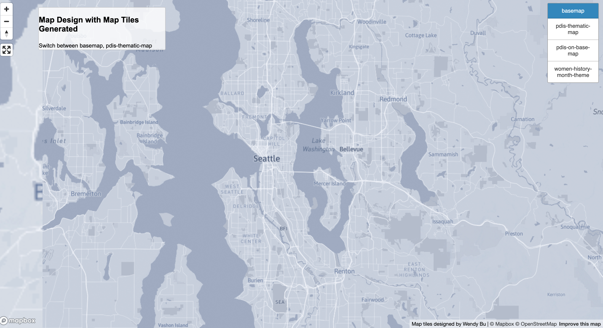
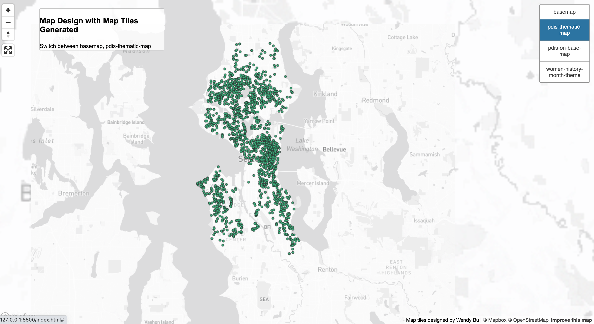
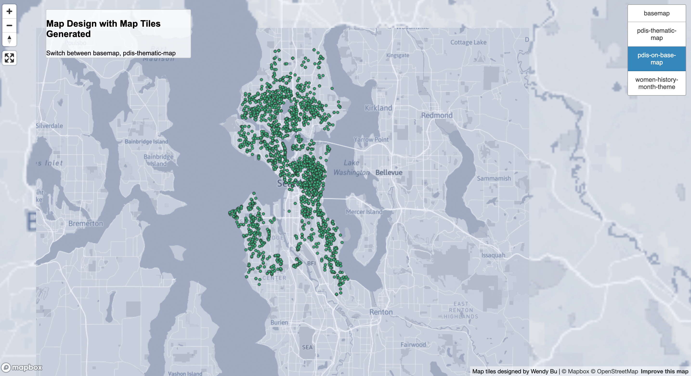
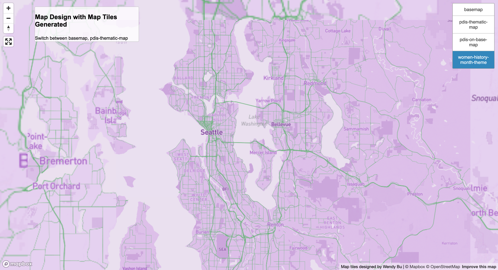

# Map_Design_with_Tile_Generation
## Seattle Disability Parking Spots and Women Month Theme Maps

[Here is the link to the web map.](https://wendybw.github.io/map_design_with_tiles/)

The examined geographic area for all four tile sets is centered in the City of Seattle and mainly expands to King County area. The scale of data of disability parking spots is within Seattle.
The available zoom level for all four tile sets is a minimum of 3 and a maximum of 14.

### Layer 1: Basemap

For the basemap, I make some changes based on the light monochrome map style provided in Mapbox. I use a light greyish blue theme and change a few fonts.

### Layer 2: PDIS in Seattle

The dataset I use for the second layer is the parking signs dataset from Seattle GeoData site. Since there are too many data in this dataset, I choose to focus on one category of the parking signs. I extract the data that only includes PDIS (Disability Parking) for a better visualization for this lab.

### Layer 3: Basemap + PDIS

For the third map layer, I was using blue dots for the data but it is hard to recognize when I added the data to the basemap I created, so I change the color to green. It is distinguished from the basemap and is a friendly color to use.

### Layer 4: Women History Month Theme

For the fourth layer, I designed a map with a women history month theme. Three commonly used colors for this theme are purple, green and white. I set the main color to be graduated color in purple which is recognized as a color of women or gender equality. I use pinkish white for rivers and lakes. The white color represents purity and equality, and I set it to be a little pinkish to better harmonize with the main theme. The roads are in green which represents new beginnings and growth.

#### Sources
- [Parking Spots from Seattle GeoData](https://data-seattlecitygis.opendata.arcgis.com/datasets/SeattleCityGIS::parking-signs-1/about)
- [WomenHistoryMonth/ GenderEquality representative colors](https://www.today.com/life/holidays/womens-history-month-colors-rcna67004)

#### Acknowledgement
- [Prof. Zhao's tutorial for this project](https://github.com/jakobzhao/geog458/tree/master/labs/lab04)
